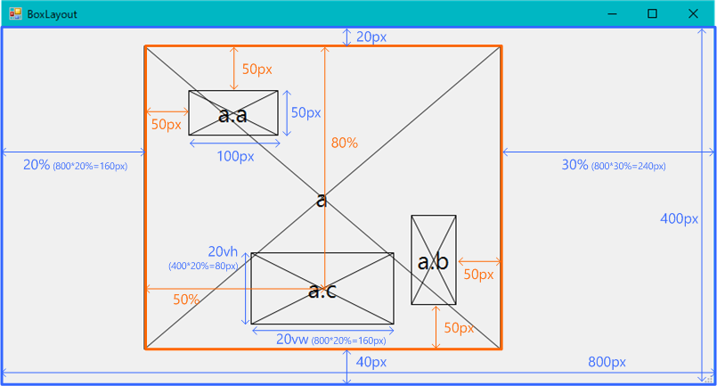
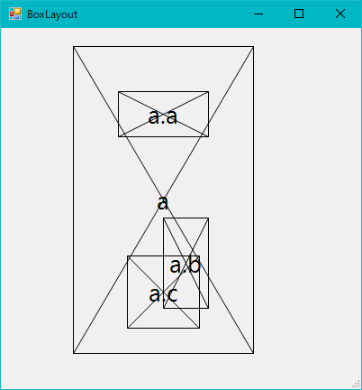

# Overview

This is very simple layout-engine for C# application.

# Usage example

```
// Initialize
var container = new BoxContainer();
container.AddBoxFromFile("boxlayout.json");
:
// On view resizing
container.Width = {view-width};
container.Height = {view-height};
container.Recalculate();
:
// On drawing
container.Traverse(box => {
  graphics.DrawRectangle(pen, box.Bounds);
});
```

# Specific attribute

Name     | Description                      | Format
---------|----------------------------------|--------
name     | Name of box. [Unique] [Required] | {name}
position | Position from parent box.        | 1: {all} <br> 2: {top & bottom} {left & right} <br> 3: {top} {left & right} {bottom} <br> 4: {top} {right} {bottom} {left}
size     | Width and height of box.         | 1: {width & height} <br> 2: {width} {height}
center   | Position of box center from left/top of parent box. | 1: {horizontal & vertical} <br> 2: {horizontal} {vertical}

Note:  
* Other attributes than above can be specified arbitrarily.  
  The user specified attribute can be obtained from 'Box' instance with the following code like that.
  ```
  string foo = box["foo"];
  ```

# Unit types of value

Unit | Description
-----|-------------
px   | Pixel.
%    | Ratio to the parent box width/height.
vw   | Ratio to width of BoxContainer.
vh   | Ratio to height of BoxContainer.
vmax | Ratio to long-side of BoxContainer.
vmin | Ratio to short-side of BoxContainer.

Note:  
* If value is '0', unit can be omitted.

# Box definition example

## XML

```
<?xml version="1.0" encoding="utf-8"?>
<root>
  <box name="a" position="20px 30% 40px 20%">
    <box name="a.a" size="100px 50px" position-left="50px" position-top="50px"></box>
    <box name="a.b" size="50px 100px" position-right="50px" position-bottom="50px"/>
    <box name="a.c" size="20vw 20vh" center="50% 80%"/>
  </box>
</root>
```

## JSON

```
[
  {
    "name": "a",
    "position": "20px 30% 40px 20%",
    "children": [
      {
        "name": "a.a",
        "size": "100px 50px",
        "position-left": "50px",
        "position-top": "50px"
      },
      {
        "name": "a.b",
        "size": "50px 100px",
        "position-right": "50px",
        "position-bottom": "50px"
      },
      {
        "name": "a.c",
        "size": "20vw 20vh",
        "center": "50% 80%"
      }
    ]
  }
]
```

## Result of layout

View size = 800 x 400 [px]  


View size = 400 x 400 [px]  

